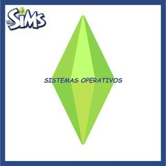

# utn-sims

Simulador de la planificación de recursos y asignación de memoria de un sistema operativo, realizado en 2023 como
Trabajo Práctico Integrador de la asignatura Sistemas Operativos.

## Equipo Los Sims

- Andrés, Aldo Omar (Diseño UI).
- Bravo Pérez, Agustín Nicolás (Coordinación).
- Peralta, Nadine (Documentación).
- Tres Palacios, Carlos (Testing).
- Vázquez, Máximo Ezequiel (Programación).

## Uso del simulador

```
python main.py workloads/livianos.csv
```

El punto de entrada del simulador es el archivo `main.py`, por lo que se lo puede ejecutar mediante el comando `python main.py`. Además requiere el nombre de un archivo CSV que contenga la carga de trabajo. Tenemos varias de prueba en la carpeta `/workloads`.

## Aspectos técnicos del simulador

Según el enunciado:

- El planificador a corto plazo usa la estrategia **round robin** con un **quantum igual a 2**.
- El esquema de memoria tiene una partición exclusiva para el sistema operativo y otras **tres particiones fijas**:
- - **250 kB** para trabajos grandes,
- - **120 kB** para trabajos medianos,
- - y **60 kB** para trabajos pequeños.
- La política de asignación a dicha memoria es **best-fit**.
- El simulador acepta una carga de trabajo con **hasta 10 procesos**.
- El simulador soporta un **grado de multiprogramación igual a 5** como máximo, pero la memoria principal solo permite 3
  procesos a la vez, por lo que se necesita usar **memoria virtual**.

Decisiones de diseño del grupo:

- Al momento de activar un proceso suspendido, se lo activa siempre en la partición de mismo tamaño que tenía
  previamente al ser suspendido.
- Al momento de elegir una partición víctima para suspender, se elije siempre la partición de mismo tamaño que la
  partición que se está trayendo a memoria principal.
- La planificación round robin tiene en cuenta a los procesos listos y listos/suspendidos por igual. Si hubiera 3
  procesos listos y 2 listos/suspendidos, el CPU se estaría compartiendo entre ellos 5, haciendo swap in y out para que
  los listos/suspendidos estén en memoria principal cuando les llegue su turno.
- Si un proceso desea ser admitido una vez alcanzado el grado de multiprogramación máximo (5), es rechazado pero se lo
  vuelve a intentar admitir en cada delta de tiempo hasta que otro proceso termine.
- Creamos un estado especial `DENEGADO` para los procesos que requieren una cantidad de memoria mayor al tamaño de la
  partición de memoria más grande, por lo que jamás podría ser admitido. Se lo envía al estado `DENEGADO` para siempre.
